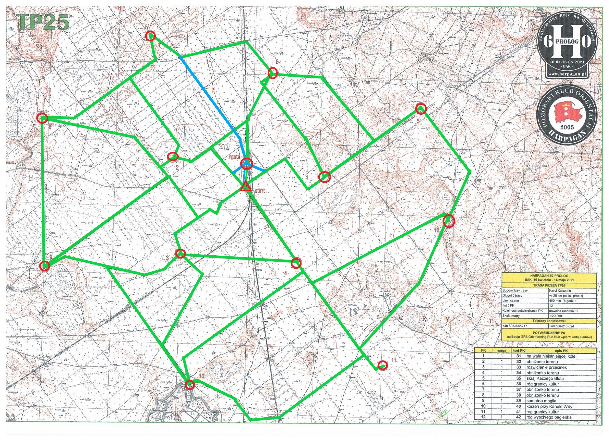
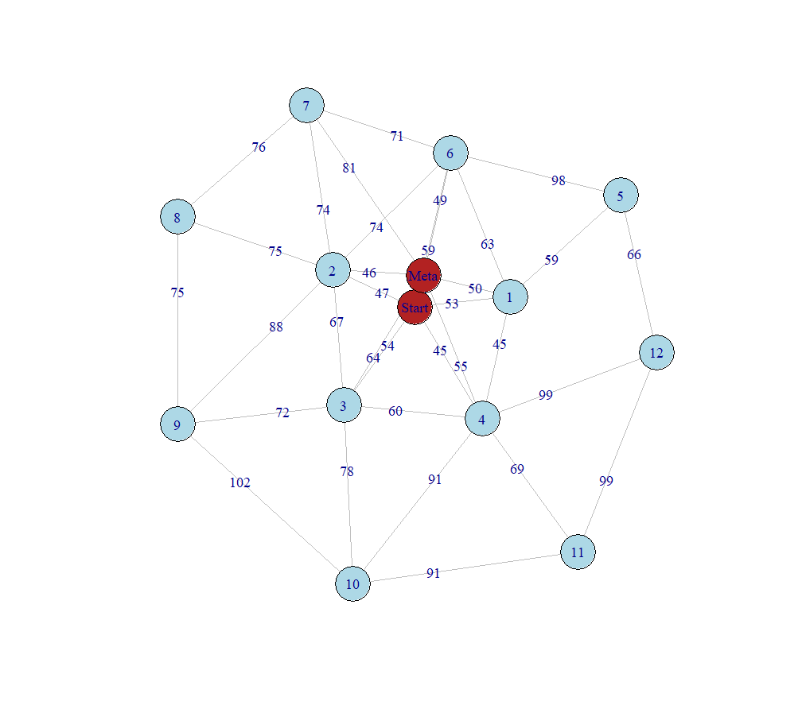

## WSTĘP


Niniejszy projekt polega na wyznaczeniu najkrótszej trasy, przechodzącej przez wszystkie punkty na mapie Harpaganu edycji 60. Ze względu na specyfikę trasy, zadanie sprowadza się do wyznaczenia najkrótszego cyklu Hamiltona w grafie ważonym, gdzie wierzchołkami są punkty na mapie, a wagi odpowiadają odległość między wierzchołkami (problem komiwojażera). Przy wyznaczaniu odległości na mapie (ręcznie, linijką) poczyniliśmy następujące założenia:

- ponieważ podana skala mapy odnosi się do konkretnego wymiaru papieru, wyznaczyliśmy nową, wiedząc że obszar terenu ma 54,6 km$^2$. Zatem przyjmujemy, że skala w naszym przypadku wynosi 1:30505.

- Przy wyznaczaniu odległości wspomagaliśmy się zapisem GPS uczestników rajdu, który można odtworzyć na stronie https://www.livelox.com/Viewer/Harpagan-60-Prolog-Bak/TP25?classId=372893 . W ten sposób mogliśmy poznać rzeczywiste trasy, to znaczy kiedy trzeba iść po drodze, a kiedy można skorzystać ze skrótu. Przy mierzeniu odległości, kierowaliśmy się zasadą że najkrótsza trasa prowadzi w linii prostej, zatem staraliśmy się wyznaczać trasy po drogach jak najbardziej zbliżonych do linii prostej. Jeśli uczestnik wybrał jakąś krótszą ścieżkę np. przez las, uznawaliśmy taką za optymalną.

Czasem na mapie zaznaczaliśmy trasę w linii prostej, natomiast do odległości dodawaliśmy kilka milimetrów, ze względu na trudności terenu.

- Nasz wyjściowy graf ma 13 wierzchołków (do zastosowania algorytmu nie bierzemy pod uwagę ostatniego wierzchołka, czyli mety, ponieważ wyznaczymy najkrótszy cykl Hamiltona zaczynając i kończąc w starcie, ostatni fragment trasy wyznaczymy ręcznie).

- Przyjęte wagi są wyznaczonymi odległościami na mapie między wierzchołkami podane w milimetrach.

Wyznaczony przez nas graf nie jest grafem pełnym, gdyż intuicja podpowiada nam, że przejścia między najbardziej skrajnymi wierzchołkami nie mogą wyznaczać najbardziej optymalnej ścieżki. Zatem najczęściej łączymy sąsiednie wierzchołki.
Na poniższym obrazku przedstawiamy zaznaczone ścieżki między wierzchołkami w wyjściowym grafie (na zielono). Ścieżki lub jej fragmenty zaznaczone na niebiesko stanowią możliwe odległości między wierzchołkami a metą.





 Na podstawie powyższej mapy w programie R narysowaliśmy  graf ważony odpowiadający naszemu zagadnieniu. 



## ALGORYTM KOMIWOJAŻERA

Ponieważ problem komiwojażera nie jest rozwiązywalny w rozsądnym czasie dla dużych  grafów,  podejdziemy do rozwiązania problemu jak do programowanie całkowitoliczbowego, korzystając z podejścia Miller-Tucker-Zemlin.

Mając dane wierzchołki  od 1 do $n$, definiujemy zmienną decyzyjną $x$  zdefiniowaną:


$$x_{ij}=\left\{ \begin{array}{rl}
1 & \textrm{,gdy ścieżka zawiera bezpośrednie połączenie między wierzchołkami $i$ i $j$} \\ 0 & \textrm{w przeciwnym wypadku}
\end{array} \right.$$

Dodatkowo, dla każdego wierzchołka $i=1,2,...,n$,  niech $u_i\in \mathbb{R}_{+}$ będzie zmienną pomocniczą oraz niech $c_{ij}$ oznacza odległość $i$ od $j$.
\

Funkcja celu jest zdefiniowana następującym wzorem
$$\min \sum_{i=1}^n \sum_{j=1}^n c_{ij}x_{ij}.$$

Aby model działał prawidłowo potrzebne są jeszcze następujące warunki
\begin{equation}
\sum_{i=1,j=1}^n x_{ij}=1.
\end{equation}

\begin{equation}
\sum_{j=1,i=1}^n x_{ij}=1.
\end{equation}
\begin{equation}
u_i+x_{ij} \leq u_j +(n-1)\cdot (1-x_{ij}) \ 2 \leq j \leq n. 
\end{equation}
\begin{equation}
u_i \in \mathbb{R}_+
\end{equation}
\begin{equation}
x_{ij}\in \{0,1\}
\end{equation}


(1)   ten warunek pilnuje, aby do wierzchołka można było przejść z dokładnie jednego  poprzedniego wierzchołka;

(2)  ten warunek zapewnia że z każdego wierzchołka można przejść do dokładnie jednego następnego wierzchołka;

(3)   eliminacja podścieżek  działa przez oznaczenie kolejności  w której wierzchołki są odwiedzane.  niech $u$  będzie rangą każdego wierzchołka  ze względu na kolejność wizyt.  wtedy $(x_{ij}=1)\Rightarrow (u_i+1=u_j).$


## PROGRAM R

Kod pochodzi częściowo ze strony https://www.r-orms.org/mixed-integer-linear-programming/practicals/problem-tsp/ i zostal zmodyfikowany na nasze potrzeby.

Program w R rozpoczęliśmy od wprowadzenie punktów z mapy na układ współrzędnych  i w ten sposób otrzymaliśmy następujący wykres.

```{r message=FALSE, warning=FALSE}
library(ggplot2)
library(ggimage)
library(grid)
library(png)
library(knitr)
library(dplyr)
library(ompr)
library(ompr.roi)
library(ROI.plugin.glpk)

# przed ponownym uruchomieniem warto wyczyścić zmienne z historii
# rm(list=ls()) 

n <- 13

punkty <- data.frame(id = 1:n,x = c(-1,0.3,-2.4,-2.3,-0.05,2.2,-0.5,-2.9,-4.9,-5,-2.15,1.5,2.78),
                     y = c(0.9,1.05,1.5,-0.94,-1.15,3,3.7,4.7,2.6,-1.3,-4.3,-3.7,0.05)
                    )
img <- readPNG("map.png")

ggplot(punkty[1:13,], aes(x, y)) + 
  annotation_custom(rasterGrob(img, 
                               width = unit(1,"npc"),
                               height = unit(1,"npc")), 
                    -Inf, Inf, -Inf, Inf) +
  geom_point(col=c("firebrick",rep("steelblue",12)),
             shape=c("triangle",rep("circle",12)),
             size=c(rep(5,13)))+
  geom_point(col="grey90",shape=c("triangle",rep("circle",12)),size = c(rep(2,13))) +
  xlim(-5.2,5.2)+
  ylim(-4.8,5.1)


```


Następnie tworzymy macierz odległości, w której elementy oznaczają odległość między wierzchołkami w milimetrach oraz jeśli punkty orientacyjne są tak odległe, że nie chcemy ich analizować, to jako odległość miedzy tymi wierzchołkami ustaliliśmy dużą liczbę $M=3000$.

```{r}
M <- 3000 # bardzo duza liczba, ktora damy jako wage miedzy wierzcholkami,
          # ktore sa tak odlegle od siebie, ze ich krawedzie pomijamy

odleglosc <- matrix(c(0,53,47,54,45,M,59,M,M,M,M,M,M,
                     53,0,M,M,45,59,63,M,M,M,M,M,M,
                     47,M,0,67,M,M,74,74,75,88,M,M,M,
                     54,M,67,0,60,M,M,M,M,72,78,M,M,
                     45,45,M,60,0,M,M,M,M,M,91,69,99,
                     M,59,M,M,M,0,98,M,M,M,M,M,66,
                     59,63,74,M,M,98,0,71,M,M,M,M,M,
                     M,M,74,M,M,M,71,0,76,M,M,M,M,
                     M,M,75,M,M,M,M,76,0,75,M,M,M,
                     M,M,88,72,M,M,M,M,75,0,102,M,M,
                     M,M,M,78,91,M,M,M,M,102,0,91,M,
                     M,M,M,M,69,M,M,M,M,M,91,0,99,
                     M,M,M,M,99,66,M,M,M,M,M,99,0),nrow = 13, ncol = 13, byrow = T)

dist_fun <- function(i, j) {
  vapply(seq_along(i), function(k) odleglosc[i[k], j[k]], numeric(1L))
}


```


Kolejnym etapem jest wprowadzenie modelu na podstawie przybliżonego algorytmu
komiwojażera. W R korzystając z pakietu *ompr* (pakiet do tworzenia mieszanych modeli liniowego programowania całkowitoliczbowego) budujemy model oparty na warunkach opisanych wyżej.


```{r message=FALSE, warning=FALSE}
model <- MIPModel() %>%
  # tworzymy zmienna x,  ktora przyjmuje wartosc 1 wtedy i tylko wtedy gdy 
  # podrozujemy  z wierzcholka i do j
  add_variable(x[i, j], i = 1:n, j = 1:n, 
               type = "integer", lb = 0, ub = 1) %>%
  
  # tworzymy zmienna pomocnicza u
  add_variable(u[i], i = 1:n, lb = 1, ub = n) %>% 
  
  # minimalizujemy odleglosci
  set_objective(sum_expr(dist_fun(i, j) * x[i, j], i = 1:n, j = 1:n), "min") %>%
  
  # warunek uniemozliwiajacy odwiedzenie tego samego wierzcholka w ktorym jestesmy
  set_bounds(x[i, i], ub = 0, i = 1:n) %>%
  
  # warunek zmuszajacy do opuszczenie kazdego miasta
  add_constraint(sum_expr(x[i, j], j = 1:n) == 1, i = 1:n) %>%
  
  #  warunek zmuszajacy do odwiedzenia kazdego miasta
  add_constraint(sum_expr(x[i, j], i = 1:n) == 1, j = 1:n) %>%
  
  # warunek wymuszajacy, ze istnieje tylko jedna sciezka obejmujaca wszystkie miasta 
  # a nie kilka rozlacznych sciezek
  add_constraint(u[i] >= 2, i = 2:n) %>% 
  add_constraint(u[i] - u[j] + 1 <= (n - 1) * (1 - x[i, j]), i = 2:n, j = 2:n)
model

```


 Realizacją owego modelu jest tabela "paths" pokazująca znalezioną
ścieżkę Hamiltona oraz jej długość.

```{r}
result <- solve_model(model, with_ROI(solver = "glpk", verbose = TRUE))

solution <- get_solution(result, x[i, j]) %>% 
  filter(value > 0) 

paths <- select(solution, i, j) %>% 
  rename(from = i, to = j) %>% 
  mutate(trip_id = row_number()) %>% 
  tidyr::gather(property, idx_val, from:to) %>% 
  mutate(idx_val = as.integer(idx_val)) %>% 
  inner_join(punkty, by = c("idx_val" = "id"))


```


Na podstawie wyznaczonej przez model ścieżki, narysowaliśmy wykres bez mety:

```{r}
ggplot(punkty[1:13,], aes(x, y)) +
  annotation_custom(rasterGrob(img, 
                               width = unit(1,"npc"),
                               height = unit(1,"npc")), 
                              -Inf, Inf, -Inf, Inf) +
  geom_point(col=c("firebrick",rep("steelblue",12)),
             shape=c("triangle",rep("circle",12)),
             size=c(rep(5,13)))+
  geom_point(col="grey90",shape=c("triangle",rep("circle",12)),size = c(rep(2,13))) +
  xlim(-5.2,5.2)+
  ylim(-4.8,5.1)+
  geom_line(data = paths, aes(group = trip_id)) + 
  ggtitle(paste0("Dlugosc sciezki: ", round(objective_value(result), 2)))

```


Wyznaczona ścieżka Hamiltona wskazuje drogę, która zaczyna i kończy się w
punkcie startu, nie przechodząc w ogóle przez metę. Dokładnie to było naszym zamiarem, ponieważ jeśli byśmy wcześniej wprowadzili punkt "Meta", a potem
wyznaczyli ścieżkę Hamiltona, to metę moglibyśmy minąć w trakcie biegu, a musimy
do niej dojść na końcu. Zatem dodajemy dopiero później wierzchołek "Meta" oraz
usuwamy ostatnią krawędź z wyznaczonej ścieżki i dodajemy krawędź łączącą metę z
ostatnim wierzchołkiem (moglibyśmy też zastanawiać się z której strony zacząć
bieg - w naszym wypadku czy od wierzchołka 2 czy 4 - jednak wybieramy za ostatni
punkt orientacyjny ten, który z tych dwóch jest najbliżej mety, czyli 2).

```{r}
# Dodajemy do tabeli "punkty" 14-sty wierzcholek, czyli META

punkty[14,]=c(14,-1,1.5)

# Tworzymy macierz z odleglosciami wierzcholkow od METY i dodajemy ja do wczesniej
# zdefiniowanej macierzy odleglosci "odleglosc"

Meta = matrix(c(10,50,46,64,55,M,49,81,M,M,M,M,M,0),nrow=1,ncol=14)

macierz2 = cbind(odleglosc,Meta[1,1:13])
macierz = rbind(macierz2,Meta)

# Znajdujemy ostatni punkt orientacyjny (czyli ten z ktorego przechodzimy do STARTU
# w cyklu Hamiltona) i krawedz ze STARTU przenosimy do METY

ost = paths[paths[,2]=="from" & paths[,3]==1,1]
paths[ost,c(3,4,5)]=c(14,-1,1.5)

# Do tablicy "paths" dodajemy informacje o wierzcholku META (numer,polaczenie i wspolrzedne)

for (i in seq(27,14)){
  paths[i,]=paths[i-1,]
}

paths[14,c(1,3,4,5)]=c(14,3,-2.4,1.5)

paths[28,]=paths[27,]
paths[28,c(1,3,4,5)]=c(14,14,-1,1.5)

# Tworzymy tabele z uporzadkowana kolejnoscia przejsc do kolejnych wierzcholkow

sciezki=paths[1:14,]
i=2
while(i<14){
  sciezki[i,]=paths[sciezki[i-1,3],]
  i=i+1
}

# Tworzymy wektor z wagami krawedzi

wagi = {}
for (i in seq(1,13)){
  wagi[i]=macierz[sciezki[i,1],sciezki[i,3]]
  i=i+1
}

# Ggplot przypisuje etykiety tylko punktom, wiec do tabeli "punkty" dodajemy srodki
# krawedzi, po to, aby przypisac im etykiety rowne wagom

punkty2=punkty[1:13,]
for (i in seq(1,13)){
  punkty2[i,]=c(i+14,(punkty[sciezki[i,1],2]+punkty[sciezki[i,3],2])/2,
                  (punkty[sciezki[i,1],3]+punkty[sciezki[i,3],3])/2)
  i=i+1
}


```


Oto docelowy wykres z metą przedstawiający najkrótszą drogę biegu, która
wynosi 897 mm na mapie, czyli po przeskalowaniu: \textbf{27,363 km} w
rzeczywistości:


```{r}
# Rysujemy wyznaczona najkrotsza sciezke

ggplot(rbind(punkty,punkty2), aes(x, y)) +
  annotation_custom(rasterGrob(img, 
                               width = unit(1,"npc"),
                               height = unit(1,"npc")), 
                    -Inf, Inf, -Inf, Inf) +
  geom_point(col=c("firebrick",rep("steelblue",12),"firebrick",rep("white",13)),
             shape=c("triangle",rep("circle",12),"square",rep("circle",13)),
             size=c(rep(5,14),rep(0,13))) +
  geom_point(col="grey90",shape=c("triangle",rep("circle",12),"square",rep("circle",13)),
             size = c(rep(2,14),rep(0,13))) +
  geom_line(data = paths, aes(group = trip_id)) + 
  geom_text(label=c(rep(0,14),wagi),size=c(rep(0,14),rep(4,13))) +
  xlim(-5.2,5.2)+
  ylim(-4.8,5.1)+
  ggtitle(paste0("Dlugosc sciezki: ",
                 objective_value(result)-macierz[1,3]+macierz[14,3]))

```


Ostatecznie przechodzimy do narysowania grafu, w którym za wagi przyjmujemy 
odległości między wierzchołkami oraz wyróżniamy krawędzie należące do
wyznaczonej najkrótszej ścieżki.

Tutaj nadarzyły się pewne przeszkody, ponieważ stworzona na
początku macierz odległości miała kilka dużych wartości $M=3000$, aby nie były
one brane pod uwagę w modelu wyznaczającym ścieżkę. Zatem teraz chcieliśmy je
zamienić na 0,aby nie rysować niepotrzebnych krawędzi. Do tego została użyta
funkcja replace().
Kolejną trudnością było wydobycie krawędzi z tabeli "paths", co było spowodowane
formatem wyników funkcji E(G). Do rozwiązania problemu posłużyliśmy się macierzą
incydencji i zliczaliśmy, które z kolei są kolejne krawędzie wyznaczone w tabeli
"paths".

Po zdobyciu wszystkich potrzebnych danych, mogliśmy wyróżnić ścieżkę i narysować
ją na grafie:

```{r message=FALSE, warning=FALSE}
# Rysujemy graf

library(igraph)

x= punkty[1:14,]$x
y=punkty[1:14,]$y
l = matrix(c(x,y), nrow=14,ncol=2)

G_wagi = matrix(rep(0,196),ncol=14,nrow=14)
for (i in seq(1,14)){
  G_wagi[i,] = replace(macierz[i,],c(macierz[i,]==M)*seq(1,14),0)
  i=i+1
}

G <- graph_from_adjacency_matrix(G_wagi,weighted=TRUE,mode="undirected")

# Znajdujemy indeksy krawedzi z sciezki Hamiltona za pomoca macierzy incydencji
# tzn. zerujemy jej elementy pod glowna przekatna, a nastepnie zliczamy, ktorymi z kolei
# krawedzia sa krawedzie z wyznaczonej trasy (jako suma jedynek)

Incydencje = as.matrix(as_adjacency_matrix(G))
for(i in seq(1,14)){
  for(j in seq(1,14)){
    Incydencje[i,j][i>j]=0
  }
}

krawedzie = {}
krawedzie[1]=sum(Incydencje[1,1:paths[1,3]])
for(i in seq(2,14)){
  for(j in seq(2,14)){
    if(paths[i,1]==i && paths[i,3]==j && i<j){
    krawedzie[i] = sum(Incydencje[1:(i-1),]) + sum(Incydencje[i,1:j])
    }
    else if(paths[i,1]==i && paths[i,3]==j && i>j){
      krawedzie[i] = sum(Incydencje[1:(j-1),]) + sum(Incydencje[j,1:i])
}}}

# Charakteryzujemy krawedzie i wierzcholki oraz wyrozniamy wyznaczona trase

V(G)$color <- c("firebrick",rep("lightblue",12),"firebrick")
V(G)$shape <- "circle"
E(G)$color <- "grey"
E(G)$width <- 1

E(G)[krawedzie]$color <- "red"
E(G)[krawedzie]$width <- 3
  
plot(G,layout = l, vertex.label=c("Start",seq(1,12),"Meta"),edge.label=E(G)$weight)


```

### Źródło


- https://www.r-orms.org/mixed-integer-linear-programming/practicals/problem-tsp/

- https://co-enzyme.fr/blog/traveling-salesman-problem-tsp-in-cplex-opl-with-miller-tucker-zemlin-mtz-formulation/


