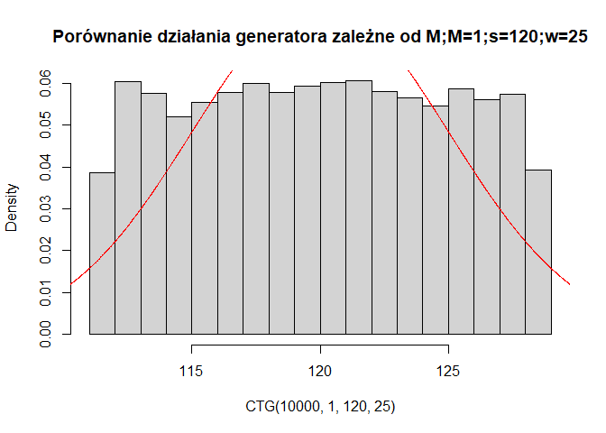
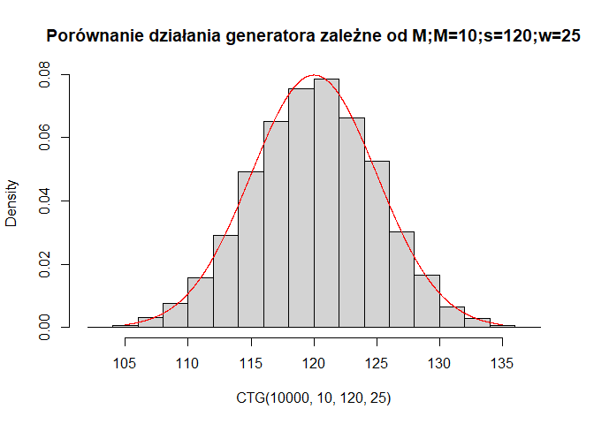
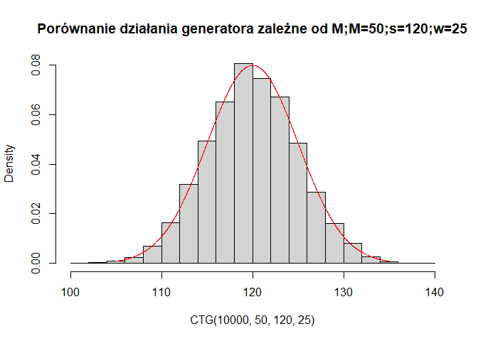
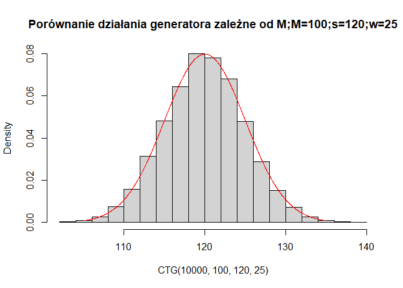
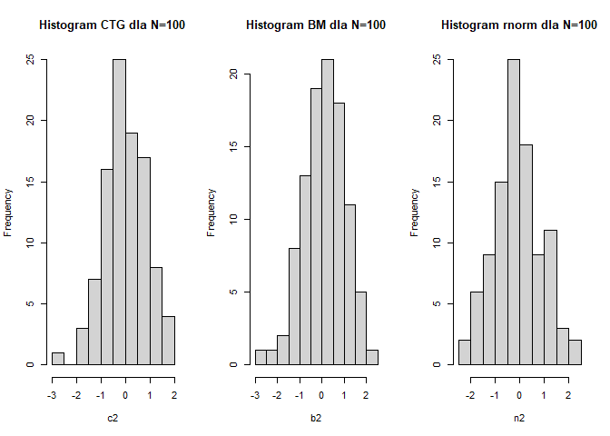
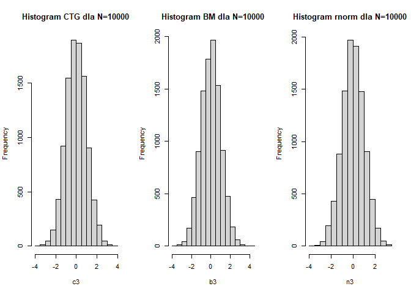

Proste generatory liczb pseudolosowych o rozkładzie normalnym
================
Agata
19.11.2020

## Generator z CTG

Utworzenie funkcji generującej liczby pseudolosowe z rozkładu normalnego
przy użyciu rozkładu jednostajnego na odc \[0,1\] z wykorzystaniem
Centralnego Twierdzenia Granicznego.

``` r
CTG <- function(N,M,s,w){
  if(w<0){print("Wariancja musi być liczbą dodatnią")}
  else{
  x={};
  z={};
  for(k in 1:N){
    x <- runif(M,min=0,max=1) #losujemy M liczb z prz[0,1] rozkładu jednostajnego
    suma=sum(x)
    
    z[k]=sqrt(w)*(suma-M*1/2)/(sqrt((1/12)*M)) + s;
  
    
  }
  return(z);
  }}
```

Wpływ liczby sumowanych zmiennych na jakość generowanych liczb z
rozkładu normalnego

``` r
x<-seq(105,135,0.01)
w=25
s=120

hist(CTG(10000,1,120,25),probability = T,main="Porównanie działania generatora zależne od M;M=1;s=120;w=25")
lines(x,(1/(sqrt(2*pi*w)))*exp((-(x-s)^2/(2*w))),col="red")
```

<!-- -->

``` r
hist(CTG(10000,10,120,25),probability = T,main="Porównanie działania generatora zależne od M;M=10;s=120;w=25")
lines(x,(1/(sqrt(2*pi*w)))*exp((-(x-s)^2/(2*w))),col="red")
```

<!-- -->

``` r
hist(CTG(10000,50,120,25),probability = T,main="Porównanie działania generatora zależne od M;M=50;s=120;w=25")
lines(x,(1/(sqrt(2*pi*w)))*exp((-(x-s)^2/(2*w))),col="red")
```

<!-- -->

``` r
hist(CTG(10000,100,120,25),probability = T,main="Porównanie działania generatora zależne od M;M=100;s=120;w=25")
lines(x,(1/(sqrt(2*pi*w)))*exp((-(x-s)^2/(2*w))),col="red")
```

<!-- -->

``` r
hist(CTG(10000,1000,120,25),probability = T,main="Porównanie działania generatora zależne od M;M=1000;s=120;w=25")
lines(x,(1/(sqrt(2*pi*w)))*exp((-(x-s)^2/(2*w))),col="red")
```

<!-- -->

Wraz ze wzrostem M dostajemy dokładniejsze przybliżenie rozkładu
normalnego.

Utworzenie funkcji generującej liczby pseudolosowe z rozkładu normalnego
przy pomocy algorytmu Boxa-Mullera.

``` r
BM <- function(N,s,w){
  if(w<0){print("Wariancja musi być liczbą dodatnią")}
  else{
  z={};
  a={};
  v={};
  if(N%%2==0){N2 = N/2}
  else(N2 = floor(N/2)+1)
  for(i in 1:N2){
    u1 = runif(1,0,1)  #losujemy 2 liczby z prz[0,1] rozkładu jednostajnego
    u2 = runif(1,0,1)
    fi = 2*(pi)*u1
    R = sqrt(-2*log(u2))
    x = sqrt(w)*R*cos(fi) + s
    y = sqrt(w)*R*sin(fi) + s
  
     z[i]=x
     a[i]=y
  }
  if(N%%2==0){
  v=c(z,a)
  
  return(v)
  }
  if(N==1){
    return(z)
    }
  else{
    v=c(z,a[1:(N2 - 1)])
    
    return(v)
  }
  }
}
```

## Porównanie generatorów

``` r
#wektory prób o różnej liczebności z wykorzystaniem centralnego tw granicznego
c1 <- CTG(10,1000,0,1)
c2 <- CTG(100,1000,0,1)
c3 <- CTG(10000,1000,0,1)

#wektory prób o różnej liczebności z wykorzystaniem algorytmu Box-Mullera
b1 <- BM(10,0,1)
b2 <- BM(100,0,1)
b3 <- BM(10000,0,1)

#wektory prób o różnej liczebności z wykorzystaniem funkcji rnorm
n1 <- rnorm(10)
n2 <- rnorm(100)
n3 <- rnorm(10000)


#histogramy
par(mfrow=c(1,3))
hist(c1, main = "Histogram CTG dla N=10")
hist(b1, main = "Histogram BM dla N=10")
hist(n1, main = "Histogram rnorm dla N=10")
```

<!-- -->

``` r
hist(c2,main = "Histogram CTG dla N=100")
hist(b2,main = "Histogram BM dla N=100")
hist(n2,main = "Histogram rnorm dla N=100")
```

<!-- -->

``` r
hist(c3,main = "Histogram CTG dla N=10000")
hist(b3,main = "Histogram BM dla N=10000")
hist(n3,main = "Histogram rnorm dla N=10000")
```

<!-- -->

``` r
sr_c1 <- mean(c1)
sr_c2 <- mean(c2)
sr_c3 <- mean(c3)

ods_c1 <- sd(c1)
ods_c2 <- sd(c2)
ods_c3 <- sd(c3)

sr_b1 <- mean(b1)
sr_b2 <- mean(b2)
sr_b3 <- mean(b3)

ods_b1 <- sd(b1)
ods_b2 <- sd(b2)
ods_b3 <- sd(b3)

sr_n1 <- mean(n1)
sr_n2 <- mean(n2)
sr_n3 <- mean(n3)

ods_n1 <- sd(n1)
ods_n2 <- sd(n2)
ods_n3 <- sd(n3)

wsp_as_c1 <- (1/length(c1)*sum((c1-sr_c1)^3))/(ods_c1^3)
wsp_as_c2 <- (1/length(c2)*sum((c2-sr_c2)^3))/(ods_c2^3)
wsp_as_c3 <- (1/length(c3)*sum((c3-sr_c3)^3))/(ods_c3^3)

wsp_as_b1 <- (1/length(b1)*sum((b1-sr_b1)^3))/(ods_b1^3)
wsp_as_b2 <- (1/length(b2)*sum((b2-sr_b2)^3))/(ods_b2^3)
wsp_as_b3 <- (1/length(b3)*sum((b3-sr_b3)^3))/(ods_b3^3)

wsp_as_n1 <- (1/length(n1)*sum((n1-sr_n1)^3))/(ods_n1^3)
wsp_as_n2 <- (1/length(n2)*sum((n2-sr_n2)^3))/(ods_n2^3)
wsp_as_n3 <- (1/length(n3)*sum((n3-sr_n3)^3))/(ods_n3^3)

kurtoza_c1 <- (1/length(c1)*sum((c1-sr_c1)^4))/(ods_c1^4) -3
kurtoza_c2 <- (1/length(c2)*sum((c2-sr_c2)^4))/(ods_c2^4) -3
kurtoza_c3 <- (1/length(c3)*sum((c3-sr_c3)^4))/(ods_c3^4) -3

kurtoza_b1 <- (1/length(b1)*sum((b1-sr_b1)^4))/(ods_b1^4) -3
kurtoza_b2 <- (1/length(b2)*sum((b2-sr_b2)^4))/(ods_b2^4) -3
kurtoza_b3 <- (1/length(b3)*sum((b3-sr_b3)^4))/(ods_b3^4) -3

kurtoza_n1 <- ((1/length(n1))*sum((n1-sr_n1)^4))/(ods_n1^4) -3
kurtoza_n2 <- ((1/length(n2))*sum((n2-sr_n2)^4))/(ods_n2^4) -3
kurtoza_n3 <- ((1/length(n3))*sum((n3-sr_n3)^4))/(ods_n3^4) -3


#tworzymy zestawienie w tabeli

metoda <- c("CTG", "CTG", "CTG", "Box-Mullera", "Box-Mullera","Box-Mullera","rnorm","rnorm","rnorm","wartosc teoretyczna" )
liczebnosc <- c(10,100,10000,10,100,10000,10,100,10000," ")
sr <- c(sr_c1,sr_c2,sr_c3,sr_b1,sr_b2,sr_b3,sr_n1,sr_n2,sr_n3,0)
od <- c(ods_c1,ods_c2,ods_c3,ods_b1,ods_b2,ods_b3,ods_n1,ods_n2,ods_n3,1)
sk <- c(wsp_as_c1,wsp_as_c2,wsp_as_c3,wsp_as_b1,wsp_as_b2,wsp_as_b3,wsp_as_n1,wsp_as_n2,wsp_as_n3,0)
kur <- c(kurtoza_c1,kurtoza_c2,kurtoza_c3,kurtoza_b1,kurtoza_b2,kurtoza_b3,kurtoza_n1,kurtoza_n2,kurtoza_n3,0)
porownanie <- data.frame(Metoda = metoda, liczebność_próby = liczebnosc, średnia=sr, odchylenie_st=od,skośność=sk,kurtoza=kur)
porownanie
```

    ##                 Metoda liczebność_próby       średnia odchylenie_st
    ## 1                  CTG               10  0.2400176314     1.1618688
    ## 2                  CTG              100  0.0065788939     0.8378103
    ## 3                  CTG            10000  0.0041104057     0.9972670
    ## 4          Box-Mullera               10  0.2340899133     1.0125420
    ## 5          Box-Mullera              100  0.1056293017     0.9411883
    ## 6          Box-Mullera            10000  0.0200432199     1.0188770
    ## 7                rnorm               10 -0.1098002705     1.0070987
    ## 8                rnorm              100 -0.0740862497     0.9892149
    ## 9                rnorm            10000 -0.0007458882     1.0002478
    ## 10 wartosc teoretyczna                   0.0000000000     1.0000000
    ##        skośność      kurtoza
    ## 1  -0.670182070 -0.369780664
    ## 2  -0.155638864 -0.126352332
    ## 3   0.026051990 -0.006203885
    ## 4   0.245124233 -1.550367815
    ## 5  -0.300756469  0.113441054
    ## 6   0.012472351 -0.036655909
    ## 7   0.476180879 -0.975154953
    ## 8   0.151394940 -0.343214283
    ## 9   0.002266177 -0.032624437
    ## 10  0.000000000  0.000000000

## Badanie reguly trzech sigm

Funkcja wyliczająca procent liczb w przedziale \[a;b\]:

``` r
procent <- function(x,a,b){
  
  proc <- (length(x[x>=a & x<= b])/length(x))*100
  return(proc)
}
```

Bazując na wartościach rozkładu normalnego możemy powiedzieć, że około:
99,7% obserwacji znajduje się w zakresie pomiędzy +/- 3 odchylenia
standardowe od średniej.

Powyższe potwierdzają wyniki:

``` r
#reguła 3 sigm dla funkcji CTG
procent(c1,sr_c1-3*ods_c1,sr_c1+3*ods_c1)  #próba 10 liczb
```

    ## [1] 100

``` r
procent(c2,sr_c2-3*ods_c2,sr_c2+3*ods_c2)  #próba 100 liczb
```

    ## [1] 99

``` r
procent(c3,sr_c3-3*ods_c3,sr_c3+3*ods_c3)  #próba 10000 liczb
```

    ## [1] 99.68

``` r
#reguła 3 sigm dla funkcji BM
procent(b1,sr_b1-3*ods_b1,sr_b1+3*ods_b1)  #próba 10 liczb
```

    ## [1] 100

``` r
procent(b2,sr_b2-3*ods_b2,sr_b2+3*ods_b2)  #próba 100 liczb
```

    ## [1] 99

``` r
procent(b3,sr_b3-3*ods_b3,sr_b3+3*ods_b3)  #próba 10000 liczb
```

    ## [1] 99.74

``` r
#reguła 3 sigm dla funkcji rnorm
procent(n1,sr_n1-3*ods_n1,sr_n1+3*ods_n1)  #próba 10 liczb
```

    ## [1] 100

``` r
procent(n2,sr_n2-3*ods_n2,sr_n2+3*ods_n2)  #próba 100 liczb
```

    ## [1] 100

``` r
procent(n3,sr_n3-3*ods_n3,sr_n3+3*ods_n3)  #próba 10000 liczb
```

    ## [1] 99.76
