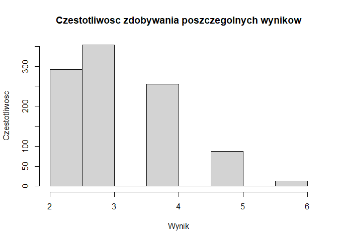
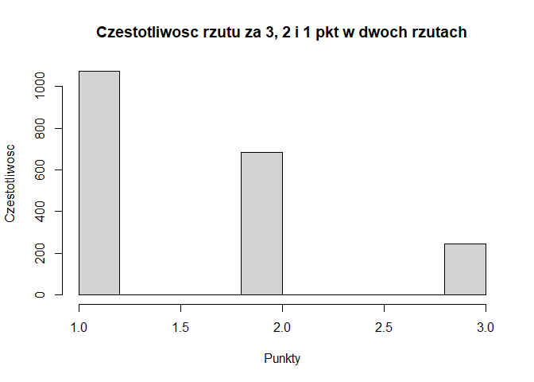

Symulacja zadania z rach. prawdopodobieństwa
================
Agata
19.10.2020

## Treść zadania

Tarcza strzelecka składa się z trzech koncentrycznych kół o promieniach
odpowiednio 1, 2 i 3. Za trafienie w środkowe koło zdobywa się 3 punkty,
za kolejne odpowiednio 2 i 1 punkt. Jakie jest prawdopodobieństwo
uzyskania co najmniej trzech punktów w dwóch strzałach? Napisz program,
który przeprowadzi 1000 symulacji powyższego doświadczenia i obliczy w
ilu przypadkach na 1000 prób uzyskano powyżej 3 punktów w dwóch
strzałach.

## Symulacja

``` r
wyniki={};
pierwsze={};
drugie={};
l_t=0; # licznik trafien za 3 pkt
l_d=0; # licznik trafien za 2 pkt
l_j=0  # licznik trafien za 1 pkt
for (i in 1:1000) {
  x1=runif(1,min=0,max=9); #losujemy 2 liczby z przedzialu [0,9] z rozkladu jednostajnego
  x2=runif(1,min=0,max=9);
  #rzut za 3pkt (jego prawdopodobieństwo to 1/9)
  if (x1 <= 1) {
    punkty1 = 3;
    l_t = l_t + 1;
  }
    if (x2 <= 1) {
    punkty2 = 3;
    l_t = l_t + 1;
      
    }
  #rzut za 2pkt (jego prawdopodobieństwo to 1/3)
  if (x1 > 1 & x1 <= 4) {
    punkty1 = 2;
    l_d = l_d + 1;
  }
  if (x2 > 1 & x2 <= 4) {
    punkty2 = 2;
    l_d = l_d + 1;
    
  }
  #rzut za 1pkt (jego prawdopodobieństwo to 5/9)
  if (x1 > 4) {
    punkty1 = 1;
    l_j = l_j + 1;
  }
  if (x2 > 4) {
    punkty2 = 1;
    l_j = l_j + 1;
    
  }
  wyniki[i]=punkty1 + punkty2;
  pierwsze[i]=punkty1
  drugie[i]=punkty2
} 
```

## Wyniki symulacji

``` r
print(paste('Trafienia za 3 pkt: ', l_t));
```

    ## [1] "Trafienia za 3 pkt:  247"

``` r
print(paste('Trafienia za 2 pkt: ', l_d));
```

    ## [1] "Trafienia za 2 pkt:  682"

``` r
print(paste('Trafienia za 1 pkt: ', l_j));
```

    ## [1] "Trafienia za 1 pkt:  1071"

Przedstawiamy również histogramy rozkladu sumy punktacji po dwóch
strzalach:

``` r
#histogram punktacji w dwóch rzutach
hist(wyniki,main = 'Czestotliwosc zdobywania poszczegolnych wynikow',xlab = 'Wynik', ylab = 'Czestotliwosc')
```

<!-- -->

oraz punktacji w każdym rzucie po dwóch strzalach:

``` r
#histogram pokazujący jak często trafiamy w pole o danej punktacji
rzuty <- c(pierwsze, drugie)

hist(rzuty,main = 'Czestotliwosc rzutu za 3, 2 i 1 pkt w dwoch rzutach',xlab = 'Punkty', ylab = 'Czestotliwosc')
```

<!-- -->

Zgodnie z oczekiwaniami najczęściej trafiamy w pole za 1pkt.

Wyliczamy prawdopodobieństwo trafienia co najmniej 3 pkt w dwóch
strzalach:

``` r
prawdopodobienstwo <-1 - (length( wyniki[wyniki<3])/length(wyniki))
print(paste('prawdopodobieństwo uzyskania co najmniej trzech punktów w dwóch strzałach: ', prawdopodobienstwo));
```

    ## [1] "prawdopodobieństwo uzyskania co najmniej trzech punktów w dwóch strzałach:  0.708"

Z teoretycznych wyliczeń wychodzi $\\frac{56}{81}$, czyli ok. 0.691,
zatem możemu uważac symulacje za poprawna.
